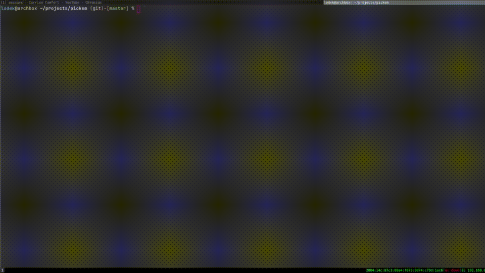

# About
Pickem is a selector which support nested options (a tree).
The options are specified in an yml file in a declarative manner.
One example would be to a tree of shortcuts to run a command.

This is a generic tool and the goal is to provide different interfaces for it, currently it provides a CLI interface.

# Demo
[]

# Yaml Spec
Each entry in the yaml file represents a node.
At a high level, each node can be thought of as a tuple with 5 values:
- Name: Name is displayed next to the cord, specifies a short human description of the node. 
- Desc: Verbose description of what a node represents.
- Chord: character or string of characters used to activate node (eg. `ab`, `e`).
- Nodes: List of children nodes
- Value: The value stored by a node. In the absence of a value, name will be returned.

The string used as the yml key implicitly defines the name for that node.
Asside from the reserved keywords, any subvalue of a yaml's entry will be considered a child.
Save from the reserved keywords, any value can be used to specify a name.

The following keywords are reserved:
- `.value` -> Specifies the return value for the selection. `value` must be specified only in leaves as it is a shortcircuiting keyword.
- `.chord` -> Indicates which character(s) are used to activate the node.
- `.desc` -> Verbose description of what the node represents.

Example
```yaml
git:
  .chord: g
  .desc: git shortcuts
  status:
    .chord: s
  add:
    .chord: a
  log:
    .chord: l
  merge:
    .chord: m
open:
  desc: common programs
  zathura:
    .chord: z
    .value: zathura
  sxiv:
    .chord: sx
  xdg-open:
    .chord: x
```

# Zsh integration
Pickem provides a zsh widget for integration.

To make use of it simply source `shell/core.zsh`, define a wrapper function that specifies the file pickem will use and set a keybind.

The following is a snipper that can be used in your shell config (assumes `core.zsh` has been sourced).

```zsh
function pickem-shell() {
    pickem-from-file ~/.pickem/shell.yml
}

zle -N pickem-shell 
bindkey '^N' pickem-shell
```
This snippet runs the pickem widget over the file `~/.pickem/shell.yml`.
